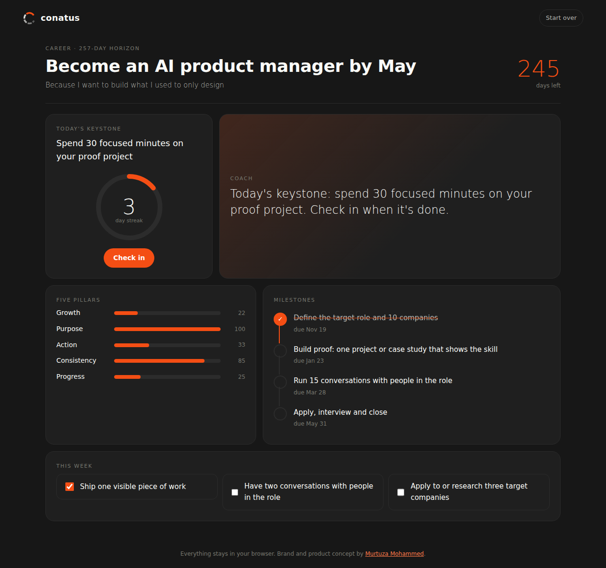
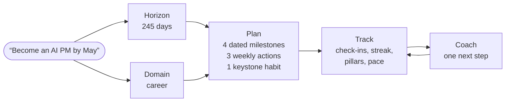

# Conatus

**An AI personal growth companion.** Tell it who you want to become. It turns that intention into a chain: a purpose, four dated milestones, three weekly actions and one daily keystone habit. Then it tracks the chain and coaches the next step.

**[Try it live →](https://murtuzabuilds.github.io/conatus/)** &nbsp;·&nbsp; [Brand identity case study](https://murtuzabuilds.com/#portfolio)



*Conatus* is Spinoza's word for the drive of every being to persist and grow. I first designed Conatus as a brand identity. This repo is the product behind the brand: the same five pillars, working.

## The five pillars

| Pillar | What it measures in the app |
|---|---|
| **Growth** | Milestones completed, plus how long the daily streak has held |
| **Purpose** | Whether you wrote down *why*. A goal without a reason scores half |
| **Action** | Share of this week's actions done |
| **Consistency** | Share of days checked in over the last 14 (or since you started) |
| **Progress** | Milestones done out of four, compared with the time elapsed |

## How it thinks



- **Planner** (`src/planner.js`) reads the time horizon ("in 8 weeks", "by May", "this year") and the domain (career, fitness, learning, creative or general), then lays out milestones evenly across the horizon.
- **Tracker** (`src/tracker.js`) computes the streak, consistency and the five pillar scores, plus *pace*: are you ahead of or behind the plan's schedule?
- **Coach** (`src/coach.js`) picks exactly one message from the state, in priority order:

| Situation | What the coach says |
|---|---|
| Two days missed | Restart small: five minutes of the habit today. The chain matters more than the size of the link |
| Milestone due within 3 days | Point this week's actions at it |
| Milestone overdue | Finish it this week or change the plan on purpose. Drifting is the only wrong answer |
| Every 7-day streak | Raise the bar a notch |
| Behind pace | Do the one action that moves the next milestone most, first |

## Design decisions

1. **One keystone habit, not a to-do list.** People keep one daily promise far more reliably than five.
2. **A missed day is expected.** The streak doesn't break on a day you haven't done yet, and the coach answers a gap with a smaller step, not guilt.
3. **Purpose is a pillar.** Writing down why measurably changes follow-through, so the app scores it and prompts for it.
4. **Private by default.** Everything lives in `localStorage`. There's no account and no server.
5. **Deterministic core, AI-ready edge.** The planner is rule-based so it's instant and testable. It returns a plain JSON shape, so an LLM planner can replace it without touching the tracker or coach.

## Run it

```bash
git clone https://github.com/murtuzabuilds/conatus && cd conatus
npm test     # 6 tests, no dependencies
npm start    # serve locally, or just open index.html through any static server
```

On the first screen, "See it with 12 days of history" loads a realistic demo, including one missed day.

## Brand

Vivid Orange `#F44E14` on near-black `#171717`, off-white `#FAFBF8`, set in Sora. The logomark is a C made of five arcs, one per pillar, fading as the chain extends.

---

Brand, product concept and code by [Murtuza Mohammed](https://murtuzabuilds.com). MIT licensed.
